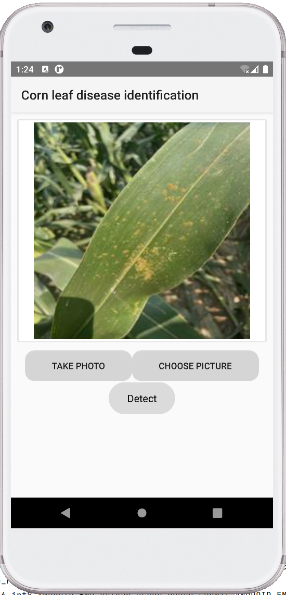
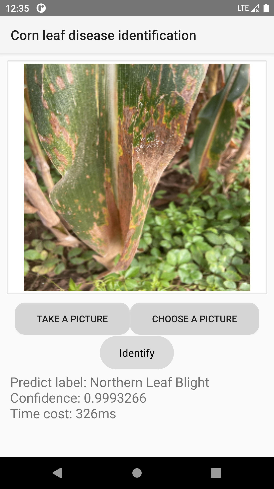
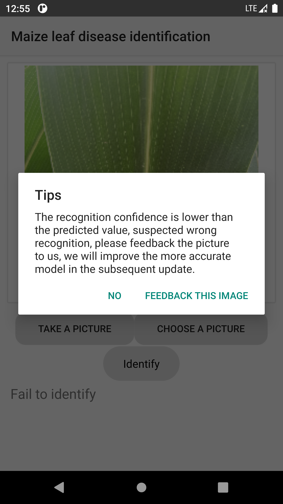

# Description
[中文文档](./README_ZH.md)
Screenshot:



You can choose to take a photo or select a picture from the collection album, and then click Detect to get the disease picture category and confidence value.



When users identify images, if the detected category confidence is less than 0.8, the user will be advised that the confidence of the image detection is low, and the user is advised to give feedback. Then we will review and retrain the model to provide more perfect and accurate disease identification.



If you think the test result is not accurate, you can also identify the feedback image by long pressing ```Detect``` on the main interface of the software. All feedback images will be stored in the repository[CornDiseaseImagesStorage](https://github.com/Brief-rf/CornDiseaseImagesStorage)

> Note, please do not feed back images unrelated to corn pests and diseases!