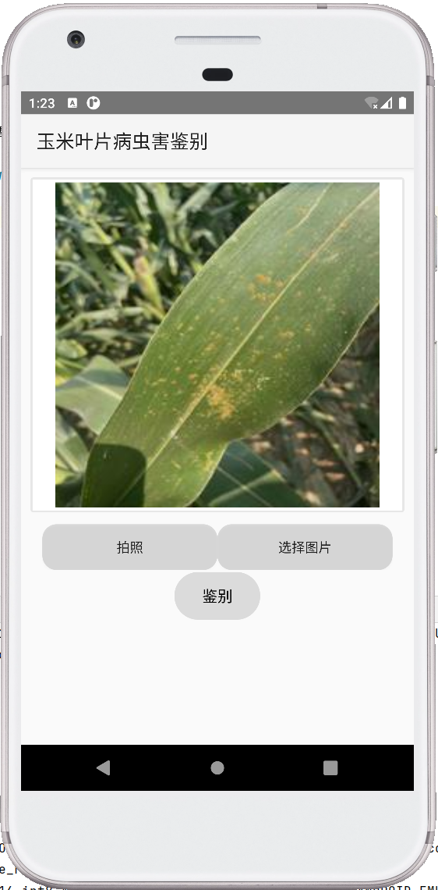
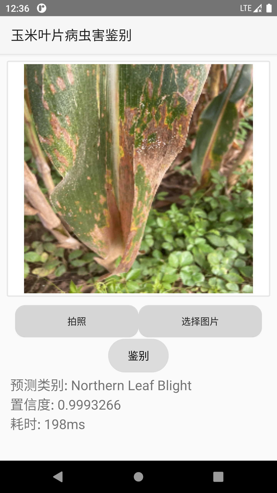
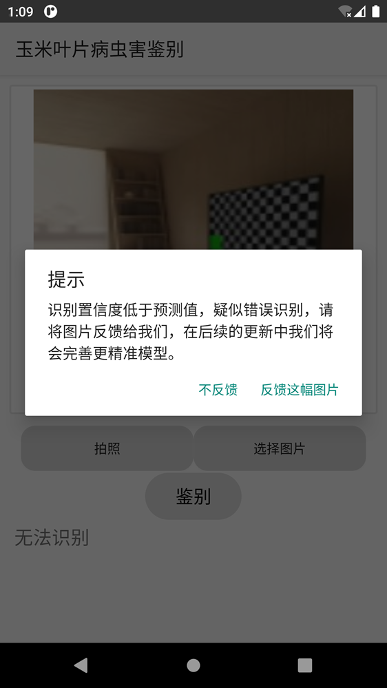

# 说明
[English](./README.md)
软件页面：



可以选择拍照或者从收集相册中选择图片，然后点击检测即可得到病害图片类别和置信度。确定好图片后点击鉴别即可。



当用户提交图片时，检测出的类别置信度小于0.8时，会提示用户图片检测的置信度偏低，建议用户反馈，后续我们会进行审核，并重新训练模型，以提供更完善准确的病害鉴别。



如果你认为检测的结果不准确，你也可以在软件主界面长按```鉴别```反馈图片。所有反馈的图片都将会存储到仓库[CornDiseaseImagesStorage](https://github.com/Brief-rf/CornDiseaseImagesStorage)

> 注意，请不要反馈与玉米病虫害无关图片！